# AI Customer Analyzer

## Introduction

AI Customer Analyzer is a computer vision and natural language processing (NLP)-based artificial intelligence technology for advanced customer analysis. This innovative prototype analyzes customer faces in real-time to predict their age, gender, emotion, and race.

This prototype contains an NLP sentiment analyzer to analyze the conversations between employees and customers through
audio processing technology that can predict sentiments on their vocals, such as negative, positive, and neutral; now, it can only work with English. Moreover, this prototype has functionalities such as counting customers and detecting whether they wear face masks; if customers wear a face mask, the system only counts them. It won't send the face to the computer vision model to process their facial attributes.

The primary idea of this project is to build an artificial intelligence system that can control the entire shopping mall and analyze customers' interests to increase productivity and sales rate.


The "AI Customer Analyzer" system is divided into the **Monitoring System** and the **Management System**.

The Monitoring System is the AI-powered part that captures and predicts customer information in real time. It leverages computer vision and artificial intelligence technology to analyze customers' faces and provide insights such as age, gender, emotion, race, and sentiment analysis. This system automatically collects data and sends it to the Management System for further processing.

The Management System is part of the system administrators use to analyze the data collected by the Monitoring System. It provides an easy-to-use interface that allows administrators to access real-time data insights and trends about their customer base. The Management System enables retailers to understand their customers better and make data-driven decisions to improve customer experience and drive revenue growth.

The "AI Customer Analyzer" system provides an end-to-end solution for retailers to gain real-time insights into their customer base. The Monitoring System captures and predicts customer information, while the Management System provides a user-friendly interface for administrators to analyze and act upon the data collected. With this powerful combination of technologies, retailers can take their customer analysis to the next level and gain a competitive advantage in the retail industry.

## System Features

### Monitoring System Features

- Able to count customers.
- Able to welcome customers with a greeting voice.
- Able to welcome visitors in Tamil, Sinhala, and English (Language can be changed in the management system)
- Able to predict the age of customers and categorize them into groups such as kids, teenage, adults, and elders.
- Able to predict gender.
- Able to predict emotions.
- Able to predict customers' race, such as Asian, White, and Black.
- Able to predict whether customers wear a mask or not.
- Able to classify customers' and employees' vocals to identify their sentiments.

### Management System Features

- Able to log in with admin credentials.
- Able to change the monitoring system's welcoming language (Tamil, Sinhala, English)
- There is a line chart on the dashboard to plot the traffics of customers.
- Many pie charts on the dashboard show age groups, genders, emotions, sentiments, and races in a graphical way.
- A page called "Vision Data." stores information about the customer, such as date, time, customer image, emotion, race, gender, age, age group, etc.; it has a filtering option where the admin can search based on dates.
- An "Audio Data" page stores information about the conversations between sales employees and customers, such as the sentiment of their negative, positive, and neutral speeches.
- Able to change the password of the management system.

**Note:** The monitoring system works as it is named and stores those prediction data in the database to be accessed by the management system for further analysis.

### Architecture Diagram

The following architecture diagram explains how this AI Customer Analyzer functions; it typically includes various components and stages that work together to analyze customer data and generate insights. Here is a breakdown of each element and its function:


### System Flow Diagram

The following system flow diagram explains how the AI Customer Analyzer system flows to analyze customer data and generate insights; it goes through various components to analyze the data using computer vision algorithms and natural language processing techniques then it produces insights data that help businesses understand customer behavior and preferences.


## Technology Stack

### Primary Programming Tools

| Programming Tools | Version     | Description                     |
| ----------------- | ----------- | ------------------------------- |
| **Python**        | Ver: 3.9    | Use to build monitoring system. |
| **MySQL**         | Ver: 15.1   | Used as central database.       |
| **Laravel**       | Ver: 10.3.3 | Use to build management system. |

### Python Dependencies (Monitoring System)

| Programming Tools   | Version       |
| ------------------- | ------------- |
| **TensorFlow**      | Ver: 2.11.0   |
| **Keras**           | Ver: 2.11.0   |
| **OpenCV**          | Ver: 4.7.0.68 |
| **MySQL Connector** | Ver: 2.2.9    |
| **PyAudio**         | Ver: 0.2.13   |
| **Pygame**          | Ver: 2.2.0    |
| **imutils**         | Ver: 0.5.4    |
| **deepface**        | Ver: 0.0.79   |

## Repo Structure

```text
.
├── docs                                  # Documents Folder.
│   ├── github-readme-content                 # Contains GitHub Readme Content.
│   └── project-documentations                # Contains Project-related Documents.
├── research                              # Contains Research files
│   ├── management-panel-template             # Template of Management System in HTML/CSS
│   ├── test-images-monitoring-system         # Monitoring System that can be tested with images instead of Camera.
│   ├── database-structure.txt                # Database Structure
│   └── google-gtts.py                        # Text to Speech Python Script File
├── source                                # Contains Source Code (Main Project Folder)
│   ├── 0-resources                           # Contains resources: database, requirements.yml
│   ├── 1-monitoring-system                   # Contains Monitoring System Project
│   └── 1-management-system                   # Contains Management System Project
├── LICENCE                               # Licence File.
└── README.MD                             # Readme file.
```

**IMPORTANT:** The soruce code of **Monitoring System** and **Management System** are found under the **soruce** folder.

## Setup

This section explains how to deploy AI Customer Analyzer on a new computer. The system has two components: **Monitoring System** and **Management System**.

### Setup Monitoring System

To set up the monitoring system, two methods are available: installing all the required dependencies from the requirements.yml file using the Anaconda environment, and the other way is installing dependencies one by one. So, the easiest way to install is using the requirements.yml method, which helps install the monitoring system without errors. However, this section covers both scenarios, installing manually and from the requirements.yml file.

**IMPORTANT:** The soruce code of the monitoring system is found under the following directory

```
ai-customer-analyzer/source/1-monitoring-system
```

#### **Method 1: Install using Anaconda Environment (Easy Method)**

This method shows how to install the dependencies easily using the Anaconda environment from the requirements.yml; this method is easy and **highly recommended** to avoid errors. Follow the steps outlined below to install the monitoring system easily.

#### **Step 01: Install Anaconda**

The first step is to install Anaconda on the deployed computer: Anaconda is a free and open-source distribution of the Python programming language and a collection of pre-built packages and tools for data science and machine learning. It includes a package manager called "conda" that simplifies the installation and management of packages and dependencies.

- Official Website: https://www.anaconda.com/

#### **Step 02: Navigate to the requirements.yml file directory**

The requirements.yml file is found under this project folder; it could be in the following directory named "monitoring-system-requirements.yml". Navigate to that directory in CMD.

```
ai-customer-analyzer\source\0-resources\1-requirements\monitoring-system-requirements.yml
```

- **The requirements file link:** **[monitoring-system-requirements.yml](source/0-resources/1-requirements/monitoring-system-requirements.yml)**

#### **Step 03: Install the requirements**

**To Install:** After the navigation to the above directory in CMD then issue the following command to install it; An example screenshot is shown below.

```
 conda env create -f monitoring-system-requirements.yml
```

- Example screenshot:

- 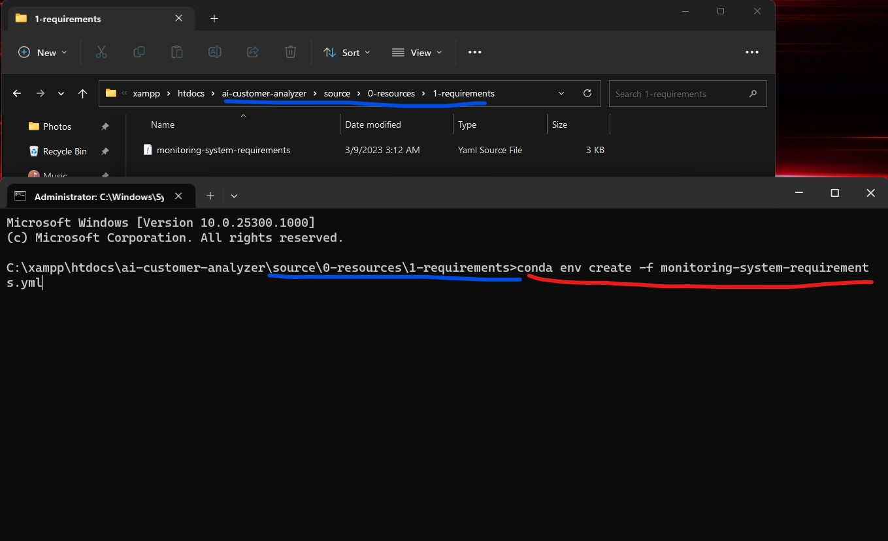

**IMPORTANT:** It will take some time to install all the dependencies automatically; after the installation, an environment will be created with the name "ai_customer_analyzer" that environment contains all the required libraries; when running the AI Customer Analyzer project, **always make sure to activate that environment** which has necessary libraries.

**To activate:** Use the following command.

```
activate ai_customer_analyzer
```

**Note:** After the activation, the project can be run on top of that environment.

#### Additional Information

There is some additional information below to learn more about the Anaconda environment.

- To Install Anaconda Environment

```
  conda env create -f environment.yml
```

- To Export Anaconda Environment

```
  conda env export > environment.yml
```

- To Delete Anaconda Environment

```
  conda env remove -n ENV_NAME
```

- To Create an Anaconda Environment

```
  conda create -n ENV_NAME python=3.9
```

#### **Method 2: Install dependencies manually**

This method shows how to install dependencies manually; the previous method of installing using conda environment is efficient and good. However, this is just to guide installing the dependencies without using the Anaconda environment.

#### **Step 01: Install Python or Anaconda**

Python is the primary programming language used in this project; earlier, we used Anaconda; the difference between Anaconda and Python is, Anaconda is a distribution of the Python programming language that comes bundled with a set of pre-installed packages and tools for scientific computing and data science. But Python is a general-purpose programming language; In summary, Python is a programming language; Anaconda is a distribution of Python that includes pre-installed packages and tools specifically for scientific computing and data science.

- Official Website Python: https://www.python.org/
- Official Website Anaconda: https://www.anaconda.com/

#### **Step 02: Install the following dependencies using PIP**

- Install TensorFlow

  ```
  pip install tensorflow==2.11.0
  ```

- Install Keras

  ```
  pip install keras==2.11.0
  ```

- Install OpenCV

  ```
  pip install opencv-python==4.7.0.68
  ```

- Install MySQL Connector

  ```
    pip install mysql-connector-python==2.2.9
  ```

- Install PyAudio

  ```
    pip install PyAudio==0.2.13
  ```

- Install Pygame

  ```
    pip install pygame==2.2.0
  ```

- Install imutils

  ```
    pip install imutils==0.5.4
  ```

- Install DeepFace

  ```
    pip install deepface==0.0.79
  ```

- Install TextBlob

  ```
    pip install textblob==0.17.1
  ```

- Install Speech Recognition

  ```
    pip install SpeechRecognition==3.9.0
  ```

**IMPORTANT:** After the installation of all the dependencies one by one, the next step is to set up the management system. Otherwise, the monitoring system won't work without the database being configured.

### Setup Management System

This section explains how to set up the management system. It is built with Laravel and can be configured quickly on shared hosting or any apache-based servers that run on PHP.

To host it locally on a computer, XAMPP control panel can be used for that. XAMPP is a free and open-source cross-platform web server solution stack package developed by Apache Friends; we can use it for local deployment of PHP-based projects.

Official Website: https://www.apachefriends.org/

**IMPORTANT 1:** The soruce code of the management system is found under the following directory

```
ai-customer-analyzer/source/2-management-system
```

**IMPORTANT 2:** Projects that are built with Laravel can be accessed by opening the **public** folder, in the source code of management system, there is a folder called public, if that opened, it could be accessed, otherwise it won't work, when deploying on servers, it is very important to point to that folder instead of pointing on index.php/index.html.

### Setup Database

The monitoring and management systems use the same database to communicate with each other. Therefore, setting up the database first is essential to make both systems work successfully.

To set the database locally, we can use the XAMPP control panel; there is a MySQL database engine and PHPMyAdmin with it. The database can be found on the following directory.

```
ai-customer-analyzer/source/0-resources/ai_customer_analyzer.sql
```

**IMPORTANT:** Give the database name as **ai_customer_analyzer**.

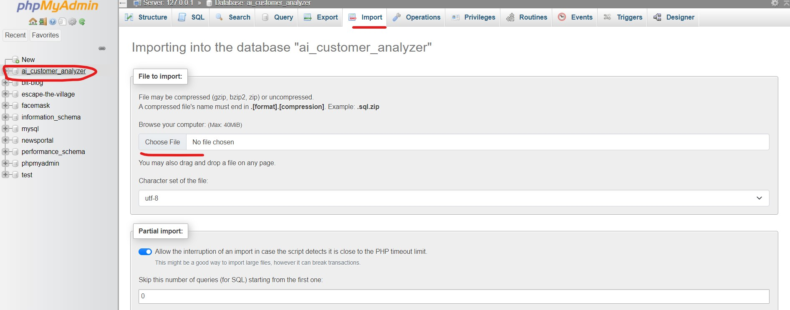

### Configuring Database with Monitoring System

This step configures the database with the monitoring system; suppose the database is hosted remotely. Letting the monitoring system know the credentials and the host is essential. Open the JSON file in the following directory to provide the database credentials and host information.

```
ai-customer-analyzer/source/1-monitoring-system/data/database-credentials.json
```

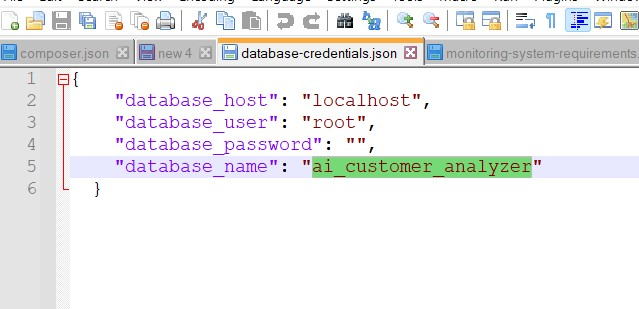

**IMPORTANT:** During the running time of the monitoring system, it sends captured information to this database; if the database is hosted somewhere other than localhost, it is important to edit this file.

### Configuring FTP with Monitoring System

When the monitoring system captures images, it uses FTP to send those images to the management panel. Therefore, setting up an FTP account with the monitoring system is essential.

**IMPORTANT 1:** Create an FTP account and point that FTP account to the following directory of the management system; the path is given below.

```
2-management-system\public\dashboard-template-assets\predictions
```

**IMPORTANT 2:** If this project is set up locally, then local FTP server can be used, there are many local FTP servers such as open-source **Filezilla server**.

**IMPORTANT 3:** There is an FTP credentials JSON file in the following directory; edit that file to change the FTP credentials.

```
ai-customer-analyzer\source\1-monitoring-system\data\ftp-credentials.json
```

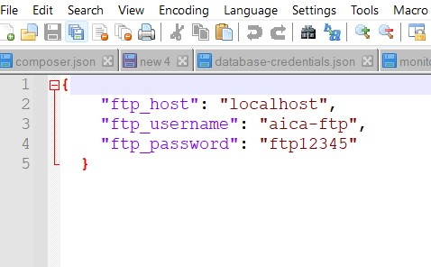

## Execution

This section shows how to run the monitoring system and the management system.

### 01 Execution of Monitoring System

The monitoring system can be found on the following directory, "1-monitoring-system", the folder can copied to any place that it wants to be deployed.

```
ai-customer-analyzer/source/1-monitoring-system
```

- Step 01: Activate the environment (**Note:** if there is no environment created, no need to activate)

```
  activate ai_customer_analyzer
```

- Step 02: Execute the vision-analyzer-main.py script

```
  python vision-analyzer-main.py
```

### 02 Execution of Monitoring System with Images

- There is a project under the research folder called "test-images-monitoring-system", this is used to test the system with images to calculate the accuracy, the project is found under the following directory.

  ```
    ai-customer-analyzer\research\test-images-monitoring-system
  ```

- Step 01: Navigate to the following directory to execute the monitoring system to run with images.

```
  ai-customer-analyzer\research\test-images-monitoring-system
```

- Step 02: Place testing images inside the "**input-images**" directory of the project.

```
  ai-customer-analyzer\research\test-images-monitoring-system\input-images\
```

- Step 03: Activate the environment (**Note:** if there is no environment created, no need to activate)

```
  activate ai_customer_analyzer
```

- Step 04: Execute the image-analyzer-main.py script

```
  python image-analyzer-main.py
```

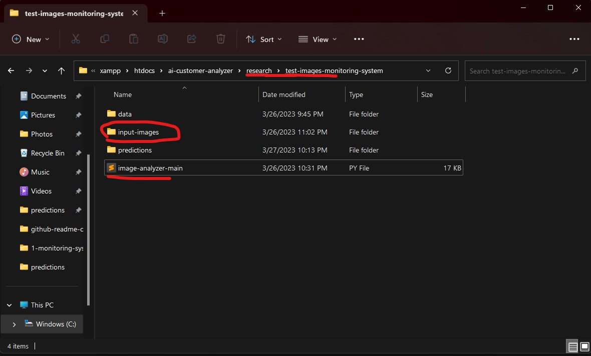

### 03 Execution of Audio Processing Script (Monitoring System)

- Step 01: Activate the environment (**Note:** if there is no environment created, no need to activate)

```
  activate ai_customer_analyzer
```

- Step 02: Execute the audio-analyzer-main.py script

```
  python audio-analyzer-main.py
```

### Execution of Management System

The management system can be opened using a web browser; it is based on where it is deployed; if it is deployed on localhost, it can be accessed by http://localhost/ and navigate to the **public** folder.

#### Management System Credentials

- Username: **admin**
- Password: **admin**

## Demonstration

This section shows demos of the projects on the monitoring and management systems; some screenshots and demo videos of the project are given below.

### 01 Monitoring System

https://user-images.githubusercontent.com/45822509/228007285-30631366-27a3-487d-b397-f64b9c43128f.mp4

### 02 Monitoring System with Images (Testing)

https://user-images.githubusercontent.com/45822509/228018476-1850c169-99a1-4a7a-888a-409fe436ce6a.mp4

### 03 Audio Processing (Monitoring System)

https://user-images.githubusercontent.com/45822509/228026260-51818429-ebc6-44a1-97a4-3b8843b1e0e7.mp4

#### Output Monitoring System


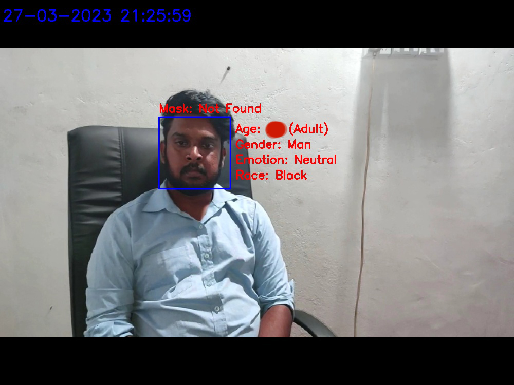

#### Output Monitoring System with Images (Testing)

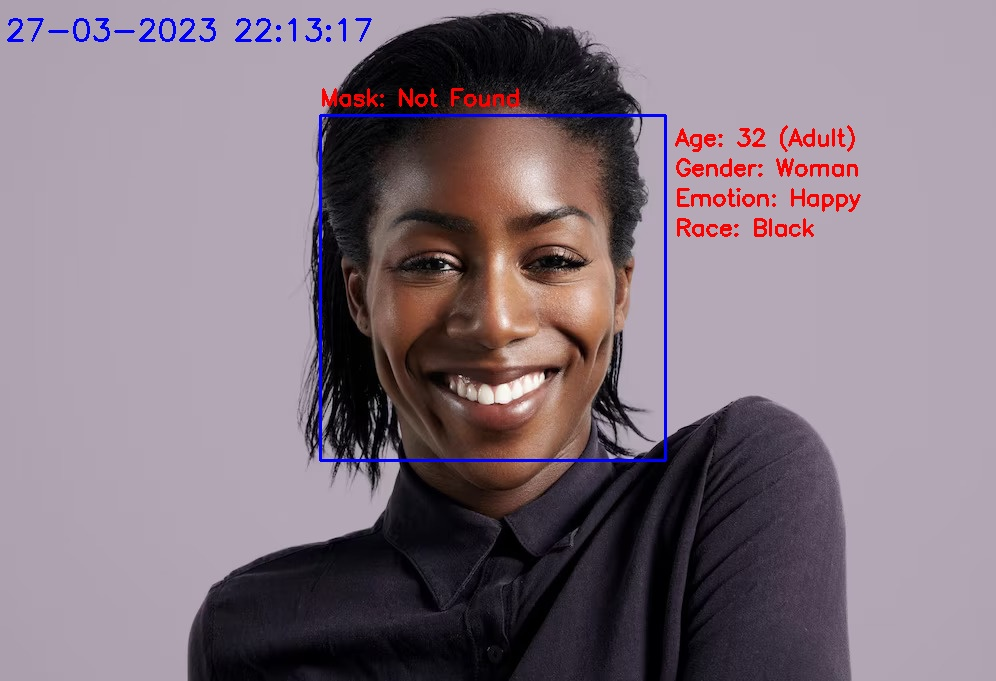

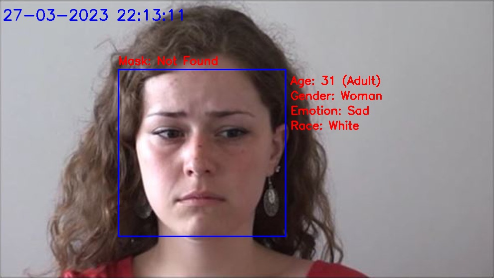


### Management System

#### Login Page

#### Management System Credentials

- Username: **admin**
- Password: **admin**

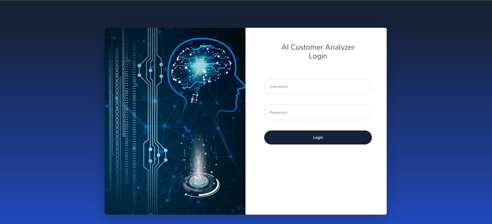

#### Home Page

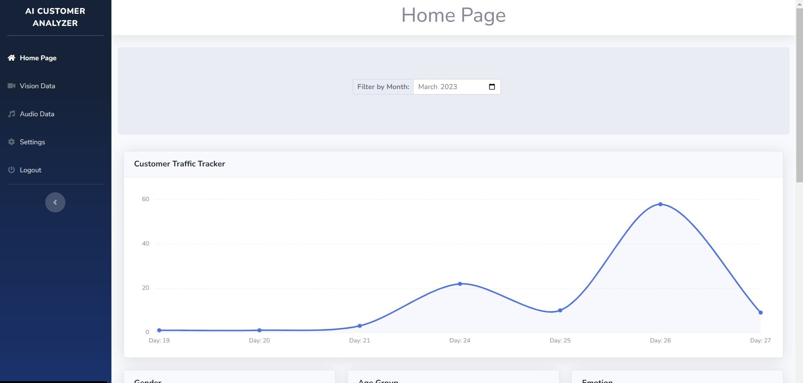

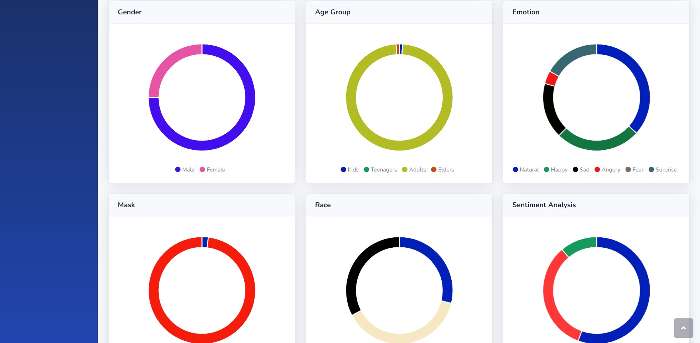

#### Vision Data Page

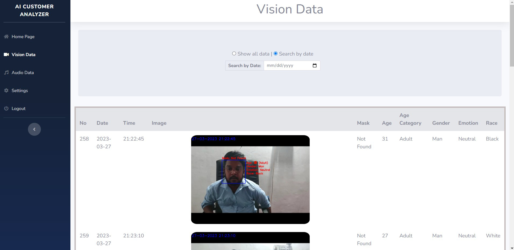

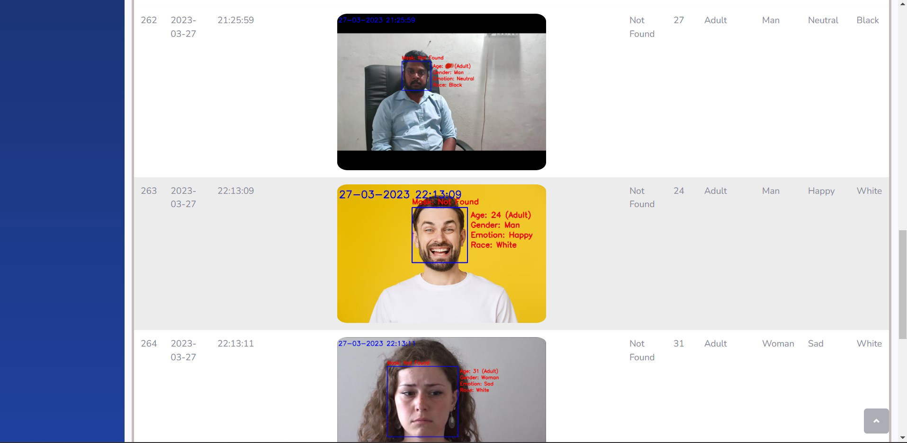

#### Audio Data Page

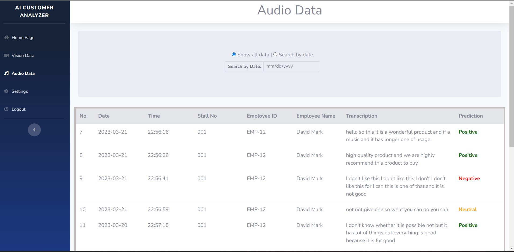

#### Settings

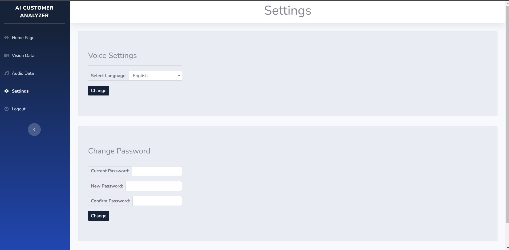

## Social Media Links

- [Linkedin Profile](https://www.linkedin.com/in/gunarakulangunaretnam/)
- [Facebook Page](https://www.facebook.com/gunarakulangunaretnam)
- [Twitter Profile](https://twitter.com/gunarakulan)
- [Instagram Profile](https://www.instagram.com/gunarakulangunaretnam/)
- [Youtube Channel](https://www.youtube.com/channel/UCMWkED5sabgVZSCKjZuRJXA)
