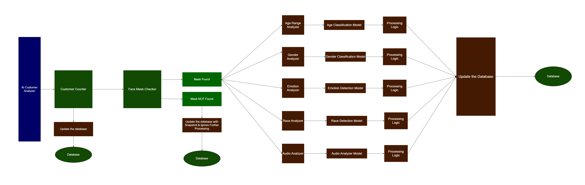

# AI Customer Analyzer

## Introduction

AI Customer Analyzer is a computer vision and natural language processing (NLP)-based artificial intelligence technology for advanced customer analysis. This innovative prototype analyzes customer faces in real-time to predict their age, gender, emotion, and race.

This prototype contains an NLP sentiment analyzer to analyze the conversations between employees and customers through
audio processing technology that can predict sentiments on their vocals, such as negative, positive, and neutral; now, it can only work with English. Moreover, this prototype has functionalities such as counting customers and detecting whether they wear face masks; if customers wear a face mask, the system only counts them. It won't send the face to the computer vision model to process their facial attributes.

The primary idea of this project is to build an artificial intelligence system that can control the entire shopping mall and analyze customers' interests to increase productivity and sales rate.

The "AI Customer Analyzer" system is divided into the **Monitoring System** and the **Management System**.

The Monitoring System is the AI-powered part that captures and predicts customer information in real time. It leverages computer vision and artificial intelligence technology to analyze customers' faces and provide insights such as age, gender, emotion, race, and sentiment analysis. This system automatically collects data and sends it to the Management System for further processing.

The Management System is part of the system administrators use to analyze the data collected by the Monitoring System. It provides an easy-to-use interface that allows administrators to access real-time data insights and trends about their customer base. The Management System enables retailers to understand their customers better and make data-driven decisions to improve customer experience and drive revenue growth.

Overall, the "AI Customer Analyzer" system provides an end-to-end solution for retailers to gain real-time insights into their customer base. The Monitoring System captures and predicts customer information, while the Management System provides a user-friendly interface for administrators to analyze and act upon the data collected. With this powerful combination of technologies, retailers can take their customer analysis to the next level and gain a competitive advantage in the retail industry.

## System Features

### Monitoring System Features

- Able to count customers.
- Able to welcome customers with a greeting voice.
- Able to welcome visitors in Tamil, Sinhala, and English (Language can be changed in the management system)
- Able to predict the age of customers and categorize them into groups such as kids, teenage, adults, and elders.
- Able to predict gender.
- Able to predict emotions.
- Able to predict customers' race, such as Asian, White, and Black.
- Able to predict whether customers wear a mask or not.
- Able to classify customers' vocals to identify their sentiments.

### Management System Features

- Able to log in with admin credentials.
- Able to change the monitoring system's welcoming language (Tamil, Sinhala, English)
- There is a line chart on the dashboard to plot the traffics of customers.
- Many pie charts on the dashboard show age groups, genders, emotions, sentiments, and races in a graphical way.
- A page called "Vision Data." stores information about the customer, such as date, time, customer image, emotion, race, gender, age, age group, etc.; it has a filtering option where the admin can search based on dates.
- An "Audio Data" page stores information about the conversations between sales customers and employees, such as the sentiment of their negative, positive, and neutral speeches.
- Able to change the password of the management system.

**Note:** The monitoring system works as it is named and stores those prediction data in the database to be accessed by the management system for further analysis.

### Architecture Diagram

The following architecture diagram explains how this AI Customer Analyzer functions; it typically includes various components and stages that work together to analyze customer data and generate insights. Here is a breakdown of each element and its function:

### System Flow Diagram

The following system flow diagram explains how the AI Customer Analyzer system flows to analyze customer data and generate insights; it goes through various components to analyze the data using computer vision algorithms and natural language processing techniques then it produces insights data that help businesses understand customer behavior and preferences.

## Technology Stack

### Primary Programming Tools

| Programming Tools | Version     | Description                     |
| ----------------- | ----------- | ------------------------------- |
| **Python**        | Ver: 3.9    | Use to build monitoring system. |
| **MySQL**         | Ver: 15.1   | Used as central database.       |
| **Laravel**       | Ver: 10.3.3 | Use to build management system. |

### Python Dependencies (Monitoring System)

| Programming Tools   | Version       |
| ------------------- | ------------- |
| **TensorFlow**      | Ver: 2.11.0   |
| **Keras**           | Ver: 2.11.0   |
| **OpenCV**          | Ver: 4.7.0.68 |
| **MySQL Connector** | Ver: 2.2.9    |
| **PyAudio**         | Ver: 0.2.13   |
| **Pygame**          | Ver: 2.2.0    |
| **imutils**         | Ver: 0.5.4    |
| **deepface**        | Ver: 0.0.79   |
